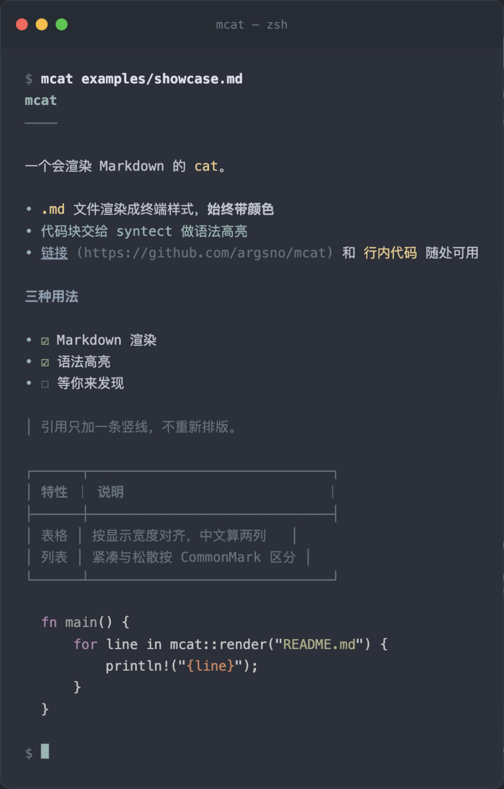

<div align="center">
  <picture>
    <source media="(prefers-color-scheme: dark)" srcset=".github/readme/banner-dark.svg">
    
  </picture>

  <p><strong>一个会渲染 Markdown 的 <code>cat</code></strong></p>

  <p>
    <a href="https://github.com/argsno/mcat/releases"></a>
    <a href="https://github.com/argsno/mcat/blob/main/LICENSE"></a>
    
    <a href="https://github.com/argsno/mcat/actions/workflows/release.yml"></a>
    <a href="https://github.com/argsno/mcat/stargazers"></a>
  </p>

  
</div>

看 Markdown、看代码、看图，一个命令。输出始终带颜色，行为和 `cat` 一致：
多个文件依次输出、读标准输入、`-` 表示标准输入、读不了的文件报错后继续。

## 三种用法

| | 命令 | 说明 |
|---|---|---|
| **Markdown 渲染** | `mcat README.md` | 标题分级配色、列表、引用、表格、任务清单、脚注，按 CommonMark 渲染 |
| **语法高亮** | `mcat src/main.rs` | 代码块和其他源码文件按语言上色，[syntect](https://github.com/trishume/syntect) 主题，纯 Rust 后端 |
| **直接看图** | `mcat examples/gradient.png` | Kitty 图形协议 / iTerm2 内联图片，图片直接画在终端里；认文件内容，不认扩展名 |

```console
$ mcat --image-rows 12 shot.jpg   # 限制图片高度
$ git log -p | mcat               # 标准输入按 Markdown 处理
$ curl … | mcat -l json           # 强制指定语言
$ mcat --no-render README.md      # 完全等同 cat
```

## 输出长什么样

- **始终带颜色**，重定向到文件也是——产物是给人看的。要纯文本用 `--no-render`（完全等同 `cat`），
  要无色排版用 `--no-color`。
- **不折行**，和 `cat` 一致；块之间固定留一个空行，一级标题下补一条等宽横线。
- **正文配色只用终端的 16 个基础色**，跟着你的调色板走；语法高亮来自 syntect 的真彩色主题，
  自动映射到 256 色。
- **表格按显示宽度对齐**（中文和全角算两列），表头加粗。
- `-n` 数的是输出行。渲染会重排块，数字和源文件对不上——和 `cat -n` 的行为一致。
- 不是合法 UTF-8 的文件原样输出，不做渲染。

## 安装

```console
$ brew install argsno/tap/mcat
```

预编译二进制，支持 macOS（arm64 / Intel）和 Linux（x86_64 / arm64）。也可以用 cargo 自己编译：

```console
$ cargo install --git https://github.com/argsno/mcat
```

## FAQ

**和 cat 有什么区别？**

cat 输出字节流，mcat 输出渲染后的样式给人看。要字节流时用 `--no-render`，那时它完全等同 cat。

**为什么重定向到文件还带颜色？**

有意的——样式随文件一起保留。要纯文本用 `--no-render`，要无色排版用 `--no-color`。

**图片没显示出来？**

用 `mcat --check-images` 排查：不输出正文，把协议从哪猜的、文件找没找到、格式、最终占多少
字符格、载荷多大，一路打出来。任何一环走不通都退回 `[image] 说明 (路径)` 的文字占位，不会报错。

**哪些终端能画图？**

| 协议 | 终端 | 备注 |
|---|---|---|
| Kitty 图形协议 | Ghostty、kitty、WezTerm、foot、Contour | 只认 PNG，其他格式转码 |
| iTerm2 内联图片 | iTerm2、WezTerm、VS Code | 原始字节交给终端解码，不转码 |

协议从环境变量猜（`TERM_PROGRAM`、`KITTY_WINDOW_ID` 等），可以用 `--image-protocol` 强制。
支持 PNG、JPEG、GIF、WebP、BMP；远程图片有 24 小时缓存。标准输入不参与图片识别——
`git log -p | mcat` 的行为不会变。

**为什么 -n 的行号和源文件对不上？**

它数的是输出行。Markdown 渲染会重排块（加横线、插空行），这和 `cat -n` 数输出行的行为是一致的。

## 开发

自己编译的步骤、代码结构、实现取舍见 [CONTRIBUTING.md](CONTRIBUTING.md)。

---

<div align="center">

**不重新排版，只上样式。**

</div>
